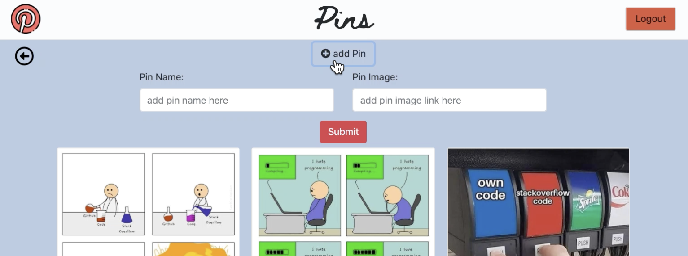

# Pinterest Project

## Technologies Used

* HTML5, CSS, Javascript
* jQuery
* SCSS
* Bootstrap
* Webpack
* Firebase

## Description

Nss project that mimics the well-known website, Pinterest. In this recreation a user will login to see boards and pins associated with their authenticated unique id. Each board has its own group of pins. Users are able to view, update, add and delete boards and pins.  A navigational back button floats on the pins view that allows a user to go back to the boards view. And users can move pins to different board names through the update feature.

**Login page:**

**Boards Page:**

**Add Board-- accordion feature:**

**Edit Board-- modal feature**

**Pins Page**

**Add Pin-- accordion feature:**

**Edit Pin-- modal feature**

[Click here to visit project website](https://pinterest-7dd20.web.app)

Or run locally:

1. Install npm http-server [Click here for instructions](https://www.npmjs.com/package/http-server)

2. [Clone project](https://help.github.com/en/github/creating-cloning-and-archiving-repositories/cloning-a-repository)

3. Open file

4. Run command: `npm install`

5. Run command: `hs -p 8080`
